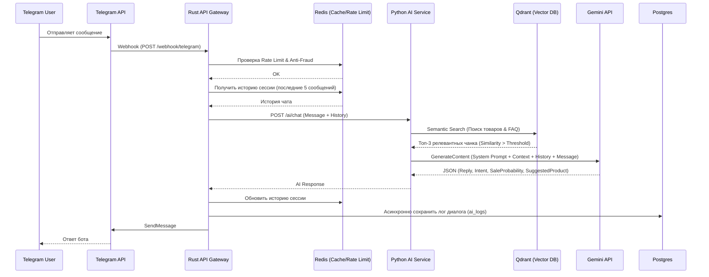

# 🤖 ENTERPRISE TELEGRAM AI ARCHITECTURE

Документация по архитектуре, потокам данных и RAG-пайплайну для Telegram AI Sales Bot.

---

## 1. АРХИТЕКТУРА И ДИАГРАММА ПОТОКОВ

Telegram-бот работает в связке с нашим Rust API Gateway и Python AI Service.



---

## 2. СХЕМА БАЗЫ ДАННЫХ (Telegram Layer)

### PostgreSQL (Реляционные данные)
```sql
-- Пользователи Telegram
CREATE TABLE tg_users (
    tg_id BIGINT PRIMARY KEY,
    username VARCHAR(255),
    first_name VARCHAR(255),
    language_code VARCHAR(10),
    is_premium BOOLEAN,
    fraud_score FLOAT DEFAULT 0.0,
    created_at TIMESTAMP DEFAULT NOW()
);

-- Сессии и контекст
CREATE TABLE tg_sessions (
    id UUID PRIMARY KEY,
    tg_id BIGINT REFERENCES tg_users(tg_id),
    status VARCHAR(50), -- active, closed, escalated_to_human
    started_at TIMESTAMP DEFAULT NOW(),
    last_activity TIMESTAMP
);

-- Логи диалогов (для аналитики и дообучения)
CREATE TABLE tg_dialog_logs (
    id UUID PRIMARY KEY,
    session_id UUID REFERENCES tg_sessions(id),
    message_type VARCHAR(10), -- 'user' or 'bot'
    content TEXT,
    intent VARCHAR(50), -- search, support, off_topic, buy
    sale_probability FLOAT,
    suggested_product_id UUID REFERENCES products(id),
    similarity_score FLOAT, -- Оценка релевантности RAG
    created_at TIMESTAMP DEFAULT NOW()
);

-- Настройки бота (Управляются из Admin Panel)
CREATE TABLE tg_bot_settings (
    id SERIAL PRIMARY KEY,
    system_prompt TEXT,
    tonality VARCHAR(50), -- friendly, professional, aggressive_sales
    similarity_threshold FLOAT DEFAULT 0.72,
    fallback_message TEXT,
    max_messages_per_minute INT DEFAULT 20
);
```

---

## 3. AI RAG PIPELINE (Retrieval-Augmented Generation)

Пайплайн обработки сообщения пользователя в Python AI Service:

### Шаг 1: Векторизация запроса (Embedding)
Сообщение пользователя превращается в вектор с помощью модели (например, `paraphrase-multilingual-mpnet-base-v2`).

### Шаг 2: Гибридный поиск контекста (Retrieval)
* **Qdrant (Semantic)**: Ищем похожие товары по описанию и вкусовому профилю.
* **Qdrant (FAQ)**: Ищем ответы на частые вопросы (доставка, гарантия).
* **Фильтрация**: Отбрасываем результаты с `score < similarity_threshold` (настраивается в админке).

### Шаг 3: Формирование Промпта (Augmentation)
Сборка финального промпта для LLM (Gemini):
```text
{System_Prompt} (из БД)
Тональность: {Tonality}

КОНТЕКСТ (Товары и FAQ):
{Retrieved_Chunks}

ИСТОРИЯ ЧАТА:
{Chat_History}

СООБЩЕНИЕ КЛИЕНТА:
{User_Message}
```

### Шаг 4: Генерация и Структурирование (Generation)
LLM возвращает строгий JSON:
```json
{
  "reply": "Текст для отправки в Telegram",
  "intent": "search_flavor",
  "sale_probability": 85,
  "suggested_product": "Elf Bar 5000 Watermelon"
}
```

---

## 4. ANTI-FRAUD & БЕЗОПАСНОСТЬ

1. **Rate Limiting**: Ограничение количества сообщений в минуту (защита от спама и перерасхода токенов LLM).
2. **Jailbreak Protection**: Системный промпт строго запрещает игнорировать предыдущие инструкции.
3. **Off-topic Rejection**: Если интент не связан с вейпингом или `similarity_score` контекста слишком низкий, бот отвечает `fallback_message`.
4. **Human Escalation**: Если `sale_probability` падает ниже 10% на протяжении 3 сообщений, бот предлагает переключить на живого оператора.
